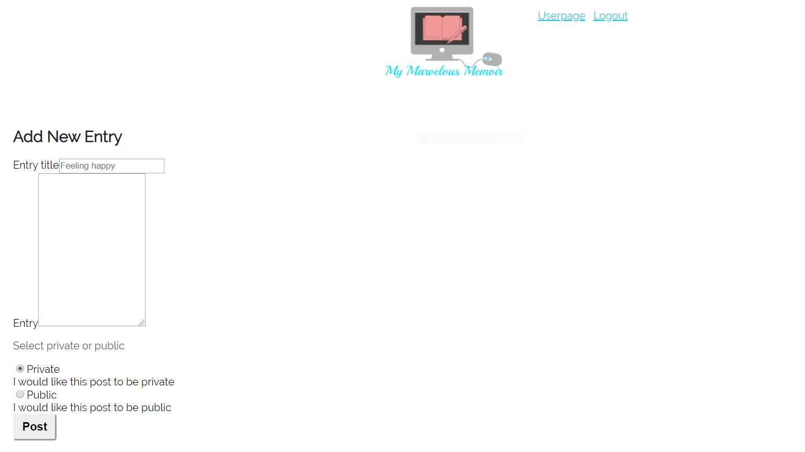
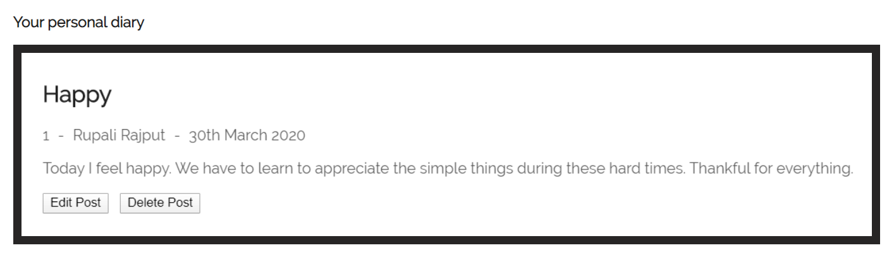

# My Marvelous Memoir

An online personal diary app that allows you to create daily posts which you can edit and delete at anytime.

## Purpose

It has proven over and over again that keeping a journal/private dairy has been effective in helping with anxiety. As someone who suffers from anxiety myself, I wanted to create an app to help people suffering from stress/anxiety that they could use from anywhere.

## Recommended Usage

For testing purposes, I recommend you test our web app with the following login credentials -

- Username: Demouser
- Password: Demo1234!

<<<<<<< HEAD
<!-- ## Screenshots

Add New Entry:

Post Example:

 -->

## Built With

- HTML5
- CSS3
- Javascript
- jQuery
- React
- PostgreSQL
- Express
- Node.js
- JWT
- Heroku/Zeit

## Demo

- [Live Demo](https://mymarvelousmemoir.now.sh/)

=======
## Built With

- HTML5
- CSS3
- Javascript
- jQuery
- React
- PostgreSQL
- Express
- Node.js
- JWT
- Heroku/Zeit

## Demo

- [Live Demo](https://mymarvelousmemoir.now.sh/)

>>>>>>> 3a11667247a9cfad2b38d187608e4c0dde89a96c
## Author

- **Rupali Rajput** - Front-End development / Back-End development / Styling
